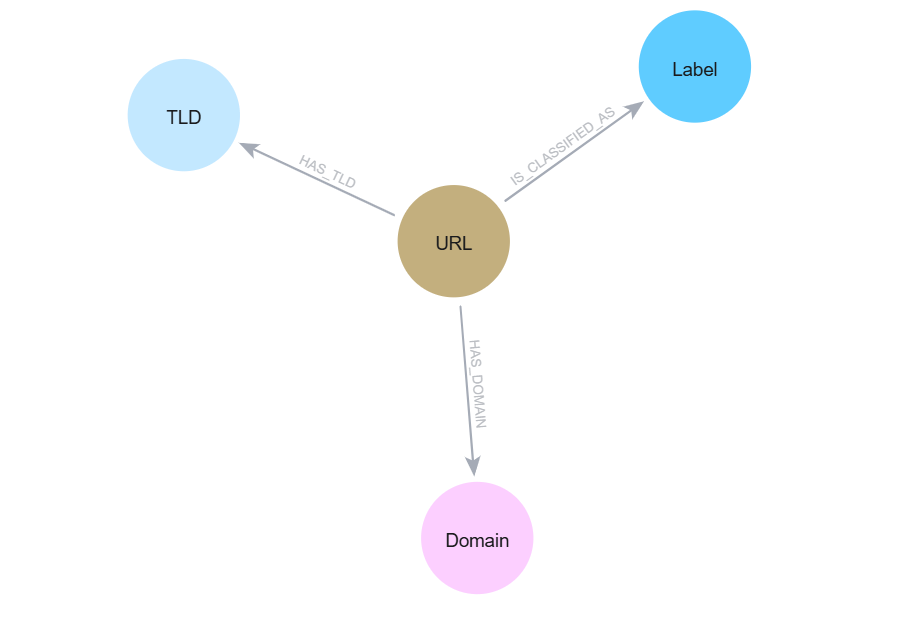
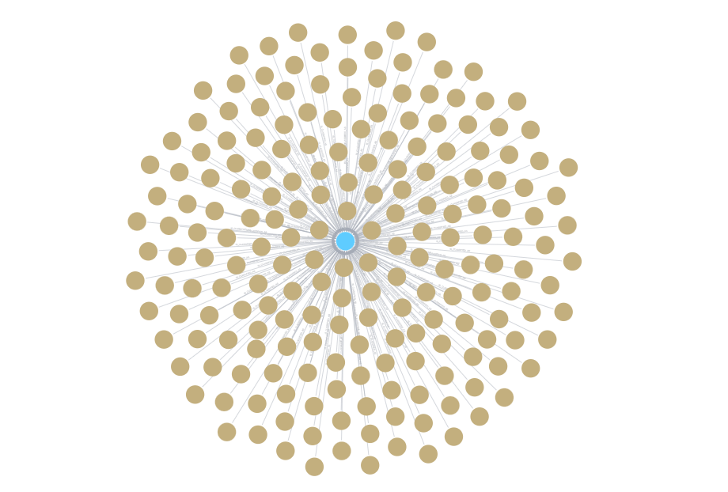
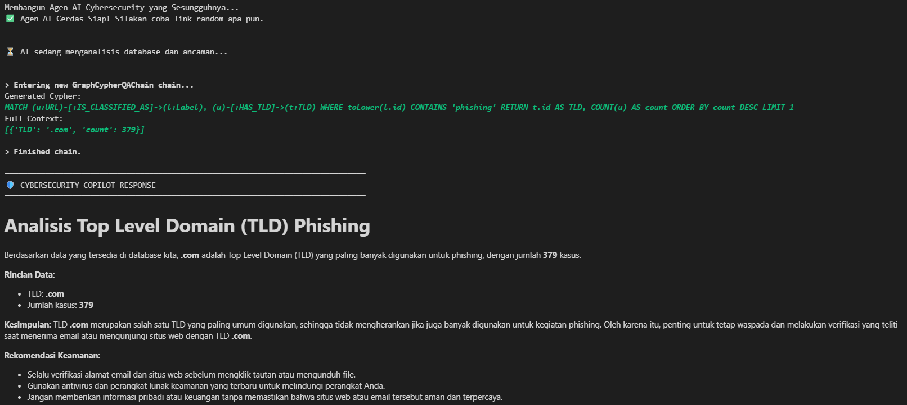
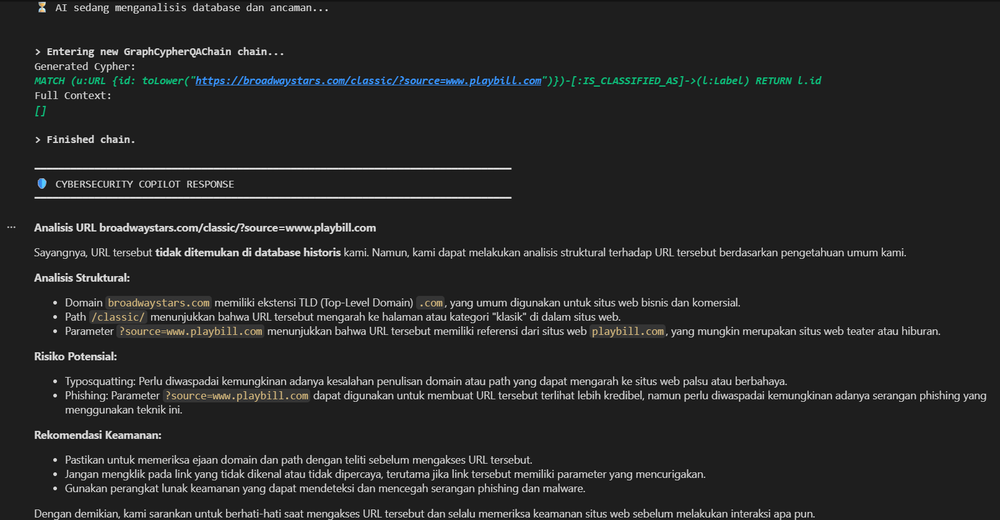

# 🛡️ Cybersecurity AI Copilot (GraphRAG System)

Aplikasi ini adalah **Agen AI Cybersecurity Cerdas** berbasis *Graph Retrieval-Augmented Generation* (GraphRAG). Sistem ini mengintegrasikan *Graph Database* untuk memetakan hubungan struktural data ancaman siber (*Phishing*, *Defacement*, *Malware*) dan menggunakan LLM untuk memberikan analisis serta rekomendasi keamanan secara *real-time* bebas halusinasi.

<br>

## 🏗️ Arsitektur Sistem & Pipeline AI

Sistem ini bergerak menggunakan arsitektur **Hybrid GraphRAG** yang memproses data terstruktur dan tidak terstruktur ke dalam satu pusat pengetahuan (*Knowledge Graph*), kemudian disajikan melalui antarmuka percakapan cerdas.

Alur kerja (*pipeline*) data dibagi menjadi 4 fase utama di dalam file eksekusi `main.ipynb`:
1. **Fase 1 (Setup & Connection):** Memuat kredensial lingkungan, mengecek koneksi Neo4j Sandbox, dan menginisialisasi LLM Engine (Groq Llama 3.3).
2. **Fase 2 & 3 (Structured Ingestion):** Membaca dataset CSV, mengekstrak fitur komponen URL secara lokal menggunakan Python, dan melakukan *bulk ingestion* ke Neo4j menggunakan kueri Cypher native.
3. **Fase 2.5 (Unstructured ETL):** Membaca teks laporan intelijen siber mentah, memanfaatkan LLM untuk mengekstrak entitas baru secara dinamis, melakukan *cleansing/normalization* data, dan menyuntikkannya ke graf.
4. **Fase 4 (GraphRAG Chatbot Agent):** Mengonversi pertanyaan *natural language* user menjadi kueri Cypher (*Text-to-Cypher*), mengambil konteks nyata dari graf, dan menyusun jawaban komprehensif.

<br>

## 📊 Skema Graf & Logika Cypher

### 1. Skema Database (Ontologi)
Graf dirancang secara efisien dengan 4 jenis **Node** dan 3 jenis **Relasi** (*Edge*):
* `(URL)` `-[:HAS_DOMAIN]->` `(Domain)`
* `(URL)` `-[:HAS_TLD]->` `(TLD)`
* `(URL)` `-[:IS_CLASSIFIED_AS]->` `(Label)`

### 2. Logika Ingestion
Proses memasukkan data massal menggunakan klausa `UNWIND` untuk iterasi cepat dan `MERGE` untuk mencegah duplikasi data (*idempotent*):
```cypher
UNWIND $data AS row
MERGE (u:URL {id: row.url})
MERGE (d:Domain {id: row.domain})
MERGE (t:TLD {id: row.tld})
MERGE (l:Label {id: row.label})

MERGE (u)-[:HAS_DOMAIN]->(d)
MERGE (u)-[:HAS_TLD]->(t)
MERGE (u)-[:IS_CLASSIFIED_AS]->(l)

```


*Deskripsi: Diagram ini memetakan cetak biru arsitektur data, menunjukkan bagaimana entitas utama (`URL`) secara struktural terhubung langsung dengan komponen penyusunnya (`Domain` dan `TLD`) serta entitas klasifikasi akhirnya (`Label`) melalui relasi yang terdefinisi secara ketat.*


### 3. Logika Text-to-Cypher
Untuk meningkatkan kecerdasan Agen AI, *prompt* dikunci dengan aturan ketat agar LLM selalu menggunakan pencarian fleksibel (`CONTAINS` dan `toLower()`). Hal ini memungkinkan pencarian berbasis kecocokan parsial/subdomain, bukan sekadar *exact match*.

<br>

## 🚀 Fitur Utama (Tier 4 Capabilities)

* **Text-to-Cypher Execution:** AI mampu menerjemahkan pertanyaan bahasa manusia menjadi kueri grafik kompleks, termasuk operasi agregasi (seperti menghitung total data atau mencari *top* entitas).
* **LLM Graph Builder:** Menggunakan `LLMGraphTransformer` untuk membaca data tidak terstruktur (teks berita/laporan siber), mengekstrak entitas secara otomatis, dan melakukan normalisasi teks secara dinamis.
* **Smart Fallback Reasoning:** Jika entitas yang dicari tidak ditemukan di database (`Context = []`), AI tidak akan memunculkan *error* atau berhalusinasi. AI akan beralih fungsi menjadi analis siber heuristik yang membedah struktur domain secara mandiri dan memberikan mitigasi risiko darurat.

<br>

## 🛠️ Tech Stack
* **Graph Database:** Neo4j (Sandbox Cloud Instance)
* **LLM Engine:** Groq API (`llama-3.3-70b-versatile`) - Inferensi super cepat untuk pemrosesan teks dan Cypher.
* **Orchestration:** LangChain, LangChain Neo4j, & LangChain Experimental (`LLMGraphTransformer`).
* **Data Processing:** Pandas, Urllib (URL Parser), & Python.

<br>

## ⚙️ Instalasi & Konfigurasi

### 1. Prasyarat (Prerequisites)
Pastikan sudah memiliki komponen berikut:
* Python terinstal di sistem.
* Akun aktif [Neo4j Sandbox](https://sandbox.neo4j.com/).
* API Key aktif dari [Groq Console](https://console.groq.com/).

### 2. Langkah Instalasi
Clone repositori ini dan jalankan instalasi *library* yang dibutuhkan:
```bash
# Clone repositori
git clone [https://github.com/username/graphrag-phishing.git](https://github.com/username/graphrag-phishing.git)
cd graphrag-phishing
```

Di dalam Notebook Jupyter (`main.ipynb`), jalankan sel pertama untuk menginstal semua *dependencies*:
```python
%pip install python-dotenv pandas neo4j langchain-neo4j langchain-experimental langchain-groq
```

### 3. Konfigurasi Lingkungan (.env)
Buat sebuah file bernama `.env` di direktori akar proyek ini, lalu isi dengan kredensial milikmu:
```env
NEO4J_URI=bolt://<isi-url-sandbox-kamu>:7687
NEO4J_USERNAME=neo4j
NEO4J_PASSWORD=<isi-password-sandbox-kamu>
GROQ_API_KEY=gsk_<isi-api-key-groq-kamu>
```

<br>

## 🏃‍♂️ Cara Menjalankan Aplikasi

Seluruh kode proyek ini dikemas secara terstruktur di dalam file **`main.ipynb`**. Ikuti urutan eksekusi berikut agar program berjalan normal:

1. **Jalankan FASE 1:** Untuk memuat file `.env`, mengecek koneksi database, dan mengaktifkan mesin LLM Groq.
2. **Jalankan FASE 2 & FASE 3 (Opsional):** * *Catatan:* Jika database Neo4j milikmu masih kosong, jalankan sel ini untuk memasukkan sampel 30.000 data dari `malicious_phish.csv`.
   * *Peringatan:* Jika database sudah terisi dari sesi sebelumnya, **lewati fase ini** atau bersihkan database terlebih dahulu lewat Neo4j Browser menggunakan perintah `MATCH (n) DETACH DELETE n` untuk menghindari duplikasi data.
3. **Jalankan FASE 2.5 (Opsional):** Jalankan sel ini jika ingin menguji kemampuan AI dalam mengekstrak dan memasukkan data dari teks laporan tidak terstruktur (Kasus Link Phishing BCA).
4. **Jalankan FASE 4:** Jalankan sel ini untuk membuka antarmuka Chatbot interaktif. Ketik pertanyaanmu langsung di kotak input yang disediakan di dalam notebook VS Code. Ketik `exit` untuk menyudahi sesi.

<br>

## 📸 Dokumentasi & Hasil Pengujian

### 1. Visualisasi Graph Database


*Deskripsi: Tampilan visual kluster radial (Starburst Pattern) pada Neo4j Browser. Ratusan Node URL terlihat berkerumun secara efisien ke satu Node Label tunggal. Visualisasi ini membuktikan bahwa klausa `MERGE` pada pipeline ETL data terstruktur berhasil melakukan deduplikasi entitas secara sempurna.*

### 2. Skenario Pengujian: Kueri Agregasi Graf (Text-to-Cypher)


*Deskripsi: Pembuktian rantai proses (verbose) Agen AI saat mengekspekstasi kueri analitik. Ketika ditanya mengenai TLD paling dominan pada kasus phishing, LLM Groq secara cerdas menerjemahkannya menjadi kueri Cypher kompleks menggunakan agregasi `COUNT()`, memprosesnya di backend Neo4j, dan berhasil menarik data riil dari graf (.com dengan 379 data).*

### 3. Skenario Pengujian: Efek Smart Fallback Heuristik


*Deskripsi: Demonstrasi fitur unggulan keselamatan RAG. Ketika diuji dengan tautan asing fiktif yang tidak terekam di database historis (Context = []), AI tidak mengalami halusinasi. Agen langsung mengaktifkan fungsi nalar kedua untuk membedah komponen struktur URL (Domain, Path, Parameter) secara mandiri guna memberikan analisis risiko dan rekomendasi mitigasi darurat.*

<br>

## 🤖 Dokumentasi Penggunaan AI (AI-Generated Code Disclosure)

Berikut adalah dokumentasi transparansi penggunaan AI dalam membantu pengembangan kode dan penyelesaian masalah (*troubleshooting*) pada proyek Cybersecurity Copilot ini:

### 1. Model AI yang Digunakan
* **Model LLM Utama (dalam aplikasi):** Llama-3.3-70b-versatile (via Groq API)
* **AI Assistant (untuk penulisan kode & diskusi):** Gemini / ChatGPT

### 2. Prompt yang Dipakai 
Dalam proses *development*, kami menggunakan AI Assistant untuk men-*generate* kerangka awal kode dan mencari solusi *error*. Berikut adalah beberapa *prompt* krusial yang kami gunakan:
* *"Buatkan kerangka kode Python menggunakan LangChain untuk menghubungkan Neo4j Graph Database dengan LLM via Groq API menggunakan modul GraphCypherQAChain."*
* *"Bagaimana cara membuat custom prompt template di LangChain agar AI bisa merespons sebagai Cybersecurity Analyst (Smart Fallback) jika kueri database mengembalikan hasil kosong / `Full Context: []`?"*
* *"Bantu identifikasi dan berikan solusi untuk error 'Failed to read from defunct connection' saat idle terlalu lama di Neo4j Sandbox."*

### 3. Modifikasi Manual yang Dilakukan terhadap Kode AI
Kode yang dihasilkan oleh AI Assistant tidak diimplementasikan secara mentah. Kami melakukan penyesuaian dan modifikasi manual secara signifikan sebagai berikut:
* **Penyesuaian Case-Sensitivity Cypher:** Mengubah logika kueri Cypher yang di-*generate* AI agar sesuai dengan skema asli di database (misalnya memastikan parameter pencarian seperti label `'phishing'` menggunakan huruf kecil semua agar kueri tidak gagal).
* **Implementasi Auto-Recovery & Warm-up:** Menulis ulang bagian koneksi Neo4j driver untuk menangani *timeout* koneksi bawaan dari Neo4j Sandbox gratisan, memastikan sesi tetap hidup saat jeda interaksi.
* **Tuning Prompt Template:** Merombak instruksi `CYPHER_GENERATION_PROMPT` bawaan AI secara manual untuk memastikan *output* selalu konsisten menggunakan format *Markdown* dan bisa menangani limitasi kueri agregasi (seperti `COUNT` dan `ORDER BY DESC`).
* **Pembatasan Scope Fallback:** Menambahkan instruksi manual pada rantai LangChain agar AI tidak berhalusinasi mengarang data statistik saat *database* kosong, melainkan hanya memberikan teori keamanan siber umum.

<br>

## 👥 Tim Pengembang

Proyek ini dirancang dan dikembangkan oleh:
* **Diva Nesia Putri** - 5026231020
* **Shahnaz Ariqah Simanullang** - 5026231087